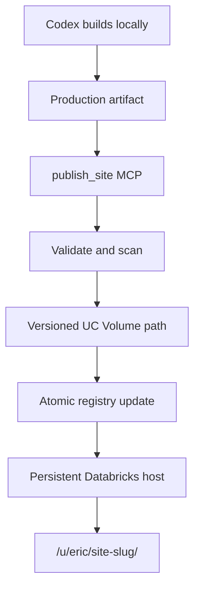

Something I've been thinking about is how to essentially recreate ChatGPT sites but with Databricks apps. And so what I'm thinking is, there must be a way where, when Codex or you, for example, you could build essentially a local app, and then if you put it, then you would zip it up, use an MCP to upload it to a target Databricks volume. Like the MCP would be, like you wouldn't see that, it would be the black box. It's just like upload zip or whatever. And then that would, and then you like do something that's like upload, which runs a job to essentially deploy that to one persistent site at a, like a subroot. So you might have like Databricks app, root URL, whatever, and then you have slash Eric slash and then the slug of whatever zip folder I upload it with, right? Or maybe I can make a name, but whatever, right? And so the key though is like, are there, do I have to have it all done in one way, right? Like if I wanna build like a React site, right? Can every site be different or do they need the same underlying runtime to be served? Presumably not because I could, I would just be serving it through, let's say, again, would it be Node, would it be FastAPI? Right, think about the fact that like some people might just want to do an HTML and CSS demo versus some people might want to do something that's a little bit bigger with React, let's say, you know, how do we enable both of those things or more. So even look up ChatGPT sites, take a look at how it works. I think you might even have a skill to use it. So take a look at the skill and how they explain that they use it.

---

Yes—this is workable, and the cleanest design is one persistent Databricks App that hosts many independently built sites.

The important boundary is:

> Let authors use different build tools, but require every uploaded site to produce the same deployable artifact.

A React site and a hand-written HTML/CSS site do not require different server runtimes once built. React normally compiles into HTML, CSS, JavaScript, and assets. Your persistent host merely serves those files.

## What ChatGPT Sites actually standardizes

ChatGPT Sites does not appear to accept completely arbitrary servers. Its workflow normalizes projects into a supported deployment format:

-   New sites normally use a Vinext starter; there is also a simpler buildless Worker starter.

-   The build must produce one Cloudflare Worker-compatible ESM entry point exposing `fetch(request, env, ctx)`, plus static assets.

-   Codex previews the running checkout, builds it, validates the artifact, saves an immutable version, then deploys that version.

-   Persistent relational data and file storage are standardized behind D1 and R2 bindings.

-   Source identity and storage bindings live in `.openai/hosting.json`.


The public documentation describes the same conceptual model: a persistent project, separately saved versions, and deployments of selected versions. [OpenAI Sites developer guide](https://learn.chatgpt.com/docs/sites)

So Sites allows considerable variation in what Codex creates, but it eventually converges everything onto a common hosting contract. That is the part worth copying.

## The Databricks equivalent I would build



The host could be FastAPI because it fits your existing Python stack. But its job would be deliberately boring:

-   Resolve `{owner}/{slug}` to the active version.

-   Check the requesting user can access it.

-   Serve the correct `index.html`, JavaScript, CSS, images, and other static files.

-   Apply the appropriate caching and security headers.

-   Optionally expose a tightly controlled platform API to generated sites.


Databricks Apps officially deploy from a Workspace folder or configured Git repository—not directly from a UC Volume. But an app can be granted access to a Volume and use it for persistent files. Therefore, you would deploy the host itself through the normal Databricks mechanism and make your uploaded sites content managed by that host. [Databricks deployment sources](https://docs.databricks.com/aws/en/dev-tools/databricks-apps/deploy?utm_source=chatgpt.com), [UC Volume app resources](https://docs.databricks.com/aws/en/dev-tools/databricks-apps/uc-volumes?utm_source=chatgpt.com)

## The artifact contract

I would have Codex upload something like:

```
site.zip
├── site.json
└── dist/
    ├── index.html
    ├── assets/
    └── ...
```

With a small manifest:

```json
{
  "schema_version": 1,
  "slug": "margin-scenario-model",
  "title": "Margin Scenario Model",
  "artifact_type": "static-spa",
  "entrypoint": "index.html",
  "spa_fallback": true,
  "requested_capabilities": [],
  "build": {
    "framework": "react",
    "commit": "abc123"
  }
}
```

The actual supported inputs could be:

| Authoring approach | Required output | Shared host compatible? |
| --- | --- | --- |
| Hand-written HTML/CSS | Static directory | Yes |
| React with Vite | Built `dist/` directory | Yes |
| Svelte/Vue/Angular SPA | Built static directory | Yes |
| Python-generated report | Exported static HTML/assets | Yes |
| React with a shared backend | Static frontend plus declared platform APIs | Yes |
| Streamlit/Gradio | Running Python process | No |
| Next.js SSR | Running Node server | No |
| Arbitrary FastAPI app | Running Python process | No |

That last group should either be transformed into the supported model or receive its own Databricks App.

Databricks itself supports Python, Node, or a hybrid project; it detects `package.json`, installs Node dependencies, installs Python dependencies, runs the frontend build, and then executes the configured command. It can even launch Node and Python together. [Databricks Apps deployment logic](https://docs.databricks.com/aws/en/dev-tools/databricks-apps/deploy?utm_source=chatgpt.com)

But that flexibility applies to one Databricks App deployment. It does not provide independent runtimes for every directory inside one running app.

## React under a subpath

The main technical complication is not React versus HTML. It is the subpath.

A generated site at:

```
https://site-host-....databricksapps.com/u/eric/margin-model/
```

must not assume it lives at `/`. Otherwise it will request:

```
/assets/app.js
```

instead of:

```
/u/eric/margin-model/assets/app.js
```

Your standard build instructions should therefore require:

-   Relative asset paths, or a deployment-supplied base path.

-   A router basename for React Router.

-   SPA fallback to that site’s `index.html`.

-   No hard-coded root-relative links.

-   A `<base>` value or injected runtime configuration.


I would have the host rewrite or inject this at publication time rather than trusting every generated app to get it exactly right.

## The MCP surface

Codex should see a small, Sites-like interface rather than Databricks internals:

```
create_site(title, slug)
publish_site(slug, artifact, expected_version?)
get_deployment_status(slug, version)
rollback_site(slug, version)
get_site(slug)
set_site_access(slug, users_or_groups)
delete_site(slug)
```

`publish_site` would be the black box you described:

1.  Authenticate the caller.

2.  Resolve their namespace.

3.  Inspect `site.json`.

4.  Reject path traversal, symlinks, oversized files, zip bombs, and unexpected executables.

5.  Validate that the entry point and asset references work.

6.  Upload to an immutable path such as:

    ```
    /Volumes/apps/sites/artifacts/eric/margin-model/01K.../
    ```

7.  Record the version and metadata.

8.  Atomically change the active-version pointer.

9.  Return the URL and immutable version ID.


You probably do not need a Databricks Job for already-built static artifacts. The MCP service can upload, validate, and update the pointer directly. A Job becomes useful if you want Databricks to build source code, run screenshots or browser tests, perform security scanning, or generate thumbnails.

I would start by having Codex perform the build locally, because that is also essentially how the current Sites skill works: validate before saving or deploying.

## Where the registry should live

Use the Volume for immutable artifact bytes, but not necessarily as your only metadata store.

A small Lakebase table is cleaner:

```
sites
- owner_id
- slug
- title
- active_version_id
- access_policy
- created_at
- updated_at

site_versions
- version_id
- owner_id
- slug
- artifact_path
- artifact_hash
- created_by
- created_at
- status
- manifest
```

Publication then becomes an atomic database update. Rollback is simply changing `active_version_id`.

The host can cache the resolved version for perhaps 5–30 seconds and cache artifact files on its ephemeral disk. Databricks explicitly says local app state disappears on restart, so the Volume or Lakebase remains authoritative. [Databricks app state](https://docs.databricks.com/aws/en/dev-tools/databricks-apps/key-concepts?utm_source=chatgpt.com)

## The major security issue

All sites beneath one host URL share a browser origin. That means JavaScript from:

```
/u/eric/foo/
```

is not naturally isolated from:

```
/u/alice/bar/
```

The browser sees both as the same origin. Arbitrary uploaded JavaScript could call any same-origin endpoint exposed by the host.

Consequently, I would define two tiers.

### Tier 1: Shared static host

Suitable for:

-   Generated dashboards with embedded data.

-   Calculators.

-   Visualizations.

-   Forms using a constrained shared API.

-   Trusted, scanned JavaScript.

-   Sites that do not receive raw credentials or broad backend access.


All server APIs must re-check the authenticated user, site ID, declared capabilities, and data permissions on every request. Never rely on the frontend path as the security boundary.

### Tier 2: Dedicated Databricks App

Required when a site needs:

-   Its own FastAPI, Streamlit, Gradio, or Node server.

-   Different OAuth scopes.

-   A separately permissioned service principal.

-   Direct access to sensitive Databricks resources.

-   Unreviewed or less-trusted executable code.

-   Strong isolation from other generated sites.


This matches Databricks’ security model: every Databricks App gets its own configuration, isolated runtime, and dedicated service principal. All deployments of that app retain that service principal. [Databricks Apps architecture](https://docs.databricks.com/aws/en/dev-tools/databricks-apps/key-concepts?utm_source=chatgpt.com), [Databricks app authorization](https://docs.databricks.com/aws/en/dev-tools/databricks-apps/auth?utm_source=chatgpt.com)

One giant host given broad table access would weaken that model substantially.

## Cost and scaling implications

A normal Databricks App currently defaults to a Medium instance: up to 2 vCPUs, 6 GB RAM, and 0.5 DBU/hour. A Large app is 1 DBU/hour. [Databricks Apps compute sizes](https://docs.databricks.com/aws/en/dev-tools/databricks-apps/compute-size?utm_source=chatgpt.com)

Therefore, ignoring any shutdown behaviour:

-   1 shared host: approximately 0.5 DBU/hour.

-   20 separately running Medium apps: approximately 10 DBU/hour.

-   That is a 20× compute difference before underlying SQL, jobs, or model-serving costs.


Horizontal scaling now exists in beta with 1–5 instances behind the same URL, sticky sessions, and rolling deployments. The cost scales linearly with instance count. [Horizontal scaling](https://docs.databricks.com/aws/en/dev-tools/databricks-apps/horizontal-scaling?utm_source=chatgpt.com)

That makes the shared static host economically attractive. It should also remain stateless because requests may reach different instances.

## My recommended first version

I would constrain v1 quite sharply:

-   One persistent FastAPI Databricks App.

-   One UC Volume containing immutable static artifacts.

-   Lakebase registry for sites, versions, access, and audit records.

-   `/u/{normalized-user}/{slug}/`.

-   Support HTML/CSS/JS and compiled SPAs.

-   Require relative/base-path-safe assets.

-   No arbitrary server code.

-   No direct browser access to Databricks credentials.

-   One `publish_site` MCP tool that accepts a validated production artifact.

-   Immutable versions and instant pointer-based rollback.

-   Authentication from Databricks-forwarded identity, followed by your own per-site authorization.

-   Dedicated Databricks App escape hatch for anything needing custom backend permissions or runtime behaviour.


That would recreate perhaps 70–80% of the useful Sites experience—prompt, build, preview, publish, stable URL, versions, rollback, identity, and storage—without initially trying to recreate a fully general serverless application platform. The remaining 20–30% is primarily isolated backend runtimes, per-site service identities, richer databases/uploads, analytics, and custom secrets. Those are exactly the features that make “one shared app with arbitrary uploaded code” much harder than “one shared app serving built sites.”

---

Okay. Good point. So one thing I like about this is, to your point, you can compile separately, right? So what the point would be is, like, you would assume that whatever is being passed in is the final distribution assets, meaning all you have to do is have an index.html and compiled assets. Meaning you could, in theory, write it in TypeScript, React, anything that compiles properly to HTML, CSS, and JavaScript. And then you zip that up, you pass it through. And then the security issue is a good point, right? And so what you would probably want to check, I think there are tools, right, that can scan the whole app looking for things like URL, or like file paths. And if there's, like, dynamic file paths that are not relative, or that don't use the base host variable, the build fails. Is there a way to do that reliably so that you can ensure it does not grab data across those boundaries, right? Like that's the key, to your point. You don't want to be grabbing assets from across the site boundaries. But then, to your point, so then you upload it to Unity Catalog for the user, a job runs, and the nice thing about that is if that Unity Catalog volume is already mounted to the Databricks app, the Databricks app just reads those surfaces for any route, right? So like for Eric, it reads, you know, slash volume slash U slash Eric. And so if someone goes to some new site, it just checks if that's there, and then falls back to, sorry, it doesn't exist if it's not there. And then I think also permissions can go in Postgres because then it would allow me to share that site with someone, right? And so I think that was the only thing. So yeah, it's anything that can be compiled to HTML, CSS, JavaScript, because in the end, that's all that's accepted, right? There's no build steps, and it's just being served through FastAPI anyways. What other considerations or approaches should I have? And the nice thing about this approach actually is I can test it on my local machine first using, for example, Tailscale, right? Like we could build this MTP and even expose it in ChatGPT to test all of the different ways that it could work and get the bugs flushed out first.

---

Exactly: the runtime contract is “static web artifact,” not “React app” or “TypeScript app.” FastAPI never runs npm or interprets source code. It serves `index.html` and immutable browser assets.

The one correction is important:

> You can reliably validate file containment and literal asset references. You cannot reliably inspect arbitrary compiled JavaScript and prove it will never request another site’s path.

JavaScript can construct URLs at runtime, open windows, register workers, or choose a URL based on user input. So scanning should catch mistakes; runtime controls must enforce the security boundary.

## Four layers of validation

| Layer | What it can guarantee |
| --- | --- |
| ZIP validation | No traversal, symlinks, zip bombs, duplicate paths, or files outside the artifact |
| Static reference validation | Declared HTML/CSS/module references resolve inside the artifact |
| Browser testing | Exercised interactions make only permitted network requests |
| Runtime enforcement | Even untested or deliberately hostile code cannot access prohibited resources |

### 1\. Make builds portable

For Vite-based applications, require:

```typescript
export default defineConfig({
  base: "./",
})
```

Vite then rewrites HTML references, CSS `url()` values, and JavaScript-imported assets to relative paths. Dynamic URLs must use `import.meta.env.BASE_URL`. [Vite documents both behaviours](https://vite.dev/guide/build?utm_source=chatgpt.com).

Your validator should parse—not merely search with regex:

-   HTML: `src`, `href`, `srcset`, `poster`, module preload and manifest references.

-   CSS: `url()` and `@import`.

-   JavaScript: static imports, exports and literal dynamic imports.

-   Web manifests and source maps, if accepted.


Reject references that:

-   Normalize outside the artifact.

-   Begin with `/`, `//`, `file:`, or an unapproved external origin.

-   Contain encoded slashes, backslashes, nulls or traversal segments.

-   Resolve to nonexistent files.

-   Differ only by case on a case-insensitive development system.


A tool such as Lychee can find broken literal links, but you still need your own artifact-aware parser and policy. [Lychee’s documented scope](https://lychee.cli.rs/guides/cli/?utm_source=chatgpt.com)

### 2\. Test actual browser traffic

Run the candidate through Chromium under its final nested path and intercept every request. Playwright can observe or block fetches, XHR, scripts, styles, images and other network traffic. [Playwright network interception](https://playwright.dev/docs/network?utm_source=chatgpt.com)

The test should fail if a request:

-   Leaves the exact immutable version prefix.

-   Reaches another site.

-   Reaches an undeclared external origin.

-   Calls an API without a declared capability.

-   Returns a 404, HTML where JavaScript was expected, or the wrong MIME type.


This catches lazy chunks, dynamic imports and runtime-created URLs that static parsing misses. It still only covers the exercised paths, so it is not the actual security boundary.

### 3\. Enforce a generated CSP

For a fully self-contained static site, the host could issue something conceptually like:

```
default-src 'none';
script-src https://host/_artifacts/SITE_ID/VERSION_ID/;
style-src https://host/_artifacts/SITE_ID/VERSION_ID/ 'unsafe-inline';
img-src https://host/_artifacts/SITE_ID/VERSION_ID/ data: blob:;
font-src https://host/_artifacts/SITE_ID/VERSION_ID/ data:;
connect-src https://host/_artifacts/SITE_ID/VERSION_ID/;
worker-src 'none';
frame-src 'none';
object-src 'none';
base-uri 'none';
form-action 'none';
```

CSP supports path-restricted source expressions, although paths are not checked after a redirect—so artifact endpoints must not redirect. It can restrict fetch, XHR, WebSockets, beacons and resource loading. [CSP Level 3 specification](https://www.w3.org/TR/CSP/?utm_source=chatgpt.com)

I would prohibit service workers initially. They persist beyond page lifetime and are scoped by origin and path. The service-worker specification specifically calls out their risk for multi-user content hosted in separate directories. [Service Workers path restriction](https://www.w3.org/TR/2019/CR-service-workers-1-20191119/?utm_source=chatgpt.com)

### 4\. Check authorization on every request

FastAPI should authorize every file request:

```
GET /u/eric/margin-model/
GET /_artifacts/<site-id>/<version-id>/index.js
GET /_artifacts/<site-id>/<version-id>/chart.css
```

The stable route performs:

1.  Resolve the authenticated Databricks user.

2.  Find the site by slug.

3.  Check the Postgres grant.

4.  Resolve the active immutable version.

5.  Return that version’s `index.html`.


Every subsequent artifact request repeats or uses a securely cached form of the authorization check.

However, even this does not provide complete isolation between two sites that the same user can access. JavaScript from site A is running on the same browser origin as site B. Path-based authorization asks “may Alice retrieve B?”—and if Alice may, malicious code running as Alice might also retrieve it.

## Three possible isolation levels

### A. Trusted generated sites

Use:

-   Static scans.

-   Browser network tests.

-   Path-restricted CSP.

-   No service workers.

-   No general-purpose backend APIs.

-   Server-side ACLs on every artifact.


This is probably sufficient for an initial system where Codex creates the sites, source is reviewable, and authors are trusted. But describe it as controlled co-hosting, not strong browser isolation.

### B. Sandboxed sites

Serve `/u/eric/foo` as a host-controlled shell containing:

```html
<iframe sandbox="allow-scripts" ...></iframe>
```

Omitting `allow-same-origin` forces the generated app into an opaque origin, preventing it from accessing same-origin cookies, local storage or other same-origin pages. [The HTML standard’s sandboxed-origin behaviour](https://html.spec.whatwg.org/dev/browsers.html?utm_source=chatgpt.com)

The tradeoff is that modern module bundles become cross-origin from the sandbox’s perspective. The cleanest artifact contract would therefore be either:

-   A single self-contained HTML file with JavaScript, CSS and small assets inlined; or

-   Versioned assets served with carefully designed CORS rules and no credentials.


Dynamic capabilities would be provided through a narrow `postMessage` bridge owned by the parent shell. For example, a site could request `read_dataset("abc")`; the host verifies the site ID, user ID and declared capability before performing it.

This is more work, but it comes closest to inexpensive per-site isolation inside one Databricks App.

### C. Separate origins

Use a separate Databricks App per site, user, team or other trust domain. This gives each one a distinct URL, runtime and service principal. Databricks App URLs are fixed per app, so native wildcard subdomains under one app are not documented as an option. [Databricks App URL behaviour](https://docs.databricks.com/aws/en/dev-tools/databricks-apps/create-custom-app?utm_source=chatgpt.com)

A reasonable compromise might be one host App per team rather than one per site.

## Publication should be versioned, not folder-driven

I would use this layout:

```
/Volumes/.../site-artifacts/
  <opaque-site-id>/
    <version-id>/
      index.html
      assets/
      site.json
      checksums.json
```

Do not use email addresses or names as the canonical storage key. They change and create normalization problems. The friendly `/u/eric/foo` route maps through Postgres to opaque IDs.

The publication state machine should be:

```
UPLOADING → VALIDATING → READY → ACTIVE
                       ↘ FAILED
```

A directory’s existence never means it is live.

The job should:

1.  Stream the ZIP into a staging version.

2.  Validate paths before extraction.

3.  Enforce file-count, expanded-size and compression-ratio limits.

4.  Validate `index.html` and its dependency graph.

5.  Scan for secrets.

6.  Run the browser/network test.

7.  Generate file hashes and a validation report.

8.  Mark the version `READY`.

9.  Optionally activate it with an optimistic concurrency condition.


Postgres then holds:

-   Sites and owners.

-   Immutable versions and their Volume paths.

-   Active-version pointer.

-   User and group grants.

-   Validation results.

-   Publication and rollback audit events.


Changing one database pointer publishes or rolls back atomically.

## Separate “save” and “publish”

I would copy this part of ChatGPT Sites:

-   `upload_site_version`: stores and validates a candidate.

-   `publish_site_version`: changes what visitors see.

-   `rollback_site`: points at an earlier version.


Uploading a ZIP should not automatically alter the production URL unless the caller explicitly asks for immediate publication. This also fits ChatGPT’s approval model for write actions.

Use an `expected_active_version` input when publishing so two Codex sessions cannot silently overwrite each other.

## Caching and routing details

A few details will prevent difficult intermittent bugs:

-   Put the version ID into asset URLs. Otherwise an old cached `index.html` can request assets after the active pointer changes.

-   Cache hashed version assets as immutable.

-   Serve the stable `index.html` with `private, no-cache` or stricter settings for sensitive content.

-   Retain old versions long enough for open browser tabs and rollback.

-   Apply SPA fallback only to extensionless HTML navigations. A missing `.js` file must return 404, not `index.html`.

-   Set correct MIME types plus `X-Content-Type-Options: nosniff`.

-   Support gzip/Brotli and byte ranges if sites can contain larger media.

-   Cache Volume files on local ephemeral disk by version hash; treat the Volume as authoritative because Databricks App local storage is not durable.

-   Benchmark many-small-file performance. A UC Volume is governed persistent storage, not a CDN.


## Static artifacts must contain no secrets

Anything in HTML or JavaScript is downloadable by every authorized viewer. Build-time variables such as `VITE_API_KEY` are not secret merely because the source project is gone.

Run source-side and artifact-side secret scanning. Trivy can scan filesystems for credentials and can also generate an SBOM when source lockfiles are retained. [Trivy filesystem scanning](https://trivy.dev/docs/latest/target/filesystem/?utm_source=chatgpt.com)

I would include provenance alongside the artifact:

```json
{
  "artifact_sha256": "...",
  "source_commit": "...",
  "builder_version": "...",
  "framework": "vite-react",
  "lockfile_sha256": "...",
  "sbom": "sbom.cdx.json"
}
```

The server should never trust ownership, user ID or requested permissions from this manifest. Those come from the authenticated publisher and server-side records.

## Permissions

Your Postgres idea is right. Give the overall host Databricks App broad `CAN USE` access, then enforce site-level access internally:

-   Owner

-   Editor/publisher

-   Viewer

-   User grant

-   Group grant


Use the immutable forwarded user ID as the principal—not the `/u/eric` segment or email address. The App’s service principal will likely be able to read the whole artifact Volume, making the FastAPI/Postgres authorization layer the real site boundary.

Databricks Apps do not currently support anonymous public access, so sharing still requires the recipient to be a recognized user in the Databricks account and able to access the host App. [Databricks App permissions](https://docs.databricks.com/aws/en/dev-tools/databricks-apps/permissions?utm_source=chatgpt.com)

## Local testing

You can reproduce nearly the whole system locally:

```
UC Volume       → ./dev-volume
Lakebase        → local Postgres
Databricks user → development auth middleware
Databricks Job  → local validation worker
Databricks App  → FastAPI
MCP             → local MCP server
```

I would test in this order:

1.  Python CLI publishes artifacts directly.

2.  Local Codex calls the MCP over localhost or stdio.

3.  Browser tests exercise sites under their real nested routes.

4.  ChatGPT calls the remote MCP.

5.  Replace the local filesystem and worker with UC Volume and a Databricks Job.

6.  Deploy the unchanged FastAPI host to Databricks Apps.


For ChatGPT specifically, Tailscale Serve is only reachable inside your tailnet. Tailscale Funnel makes the endpoint public. OpenAI’s current guidance says ChatGPT does not connect directly to local MCP servers and recommends Secure MCP Tunnel for private/local servers. [OpenAI MCP developer-mode guidance](https://help.openai.com/en/articles/12584461-developer-mode-apps-and-full-mcp-connectors-in-chatgpt-beta?utm_source=chatgpt.com), [Tailscale Serve versus Funnel](https://tailscale.com/docs/features/tailscale-serve?utm_source=chatgpt.com)

So I would use:

-   Local Codex → local MCP directly.

-   ChatGPT → Secure MCP Tunnel where available.

-   Tailscale Funnel only as a temporary alternative, with real OAuth, rate limits and an endpoint bound only to localhost.


One present product limitation: OpenAI’s public documentation says write-capable custom MCP is currently for Business and Enterprise/Edu; Pro custom MCP access is limited to read/fetch. Publishing is a write operation. That may determine which workspace you use for the ChatGPT test.

My preferred v1 would therefore be: trusted static sites, strict CSP, no service workers, no external network, immutable versions, Postgres ACLs, and both static and Playwright validation. Add opaque-origin sandboxing before allowing broader authorship or sites containing meaningfully different confidential data.
